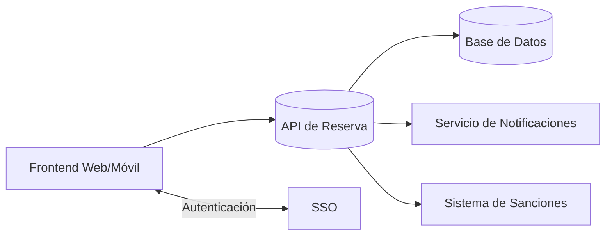

# study-room-reservation-backend[README_Sistema_Reserva_Salas.md](https://github.com/user-attachments/files/23565732/README_Sistema_Reserva_Salas.md)
# Sistema de Reserva de Salas de Estudio

> **Autor:** Khaled Benavides  
> **Última actualización:** 2025-11-16

---

## 📘 Descripción
Plataforma web para que estudiantes **reserven salas de estudio por hora** en la biblioteca. Incluye **cancelaciones con antelación**, **recordatorios automáticos**, **check‑in/no‑show** y **bloqueo por sanciones**. Este README resume el **alcance funcional**, **arquitectura**, **API propuesta**, **modelado** y **pautas de calidad** del sistema.

> Nota: Las imágenes de diagramas están referenciadas con rutas locales **del entorno de esta conversación** (sandbox). Al subir el proyecto a tu repositorio, coloca las imágenes en `docs/` y **actualiza las rutas**.

---

## 🗺️ Tabla de Contenidos
- [Descripción](#-descripción)
- [Características (RF)](#-características-rf)
- [Requisitos No Funcionales (RNF)](#-requisitos-no-funcionales-rnf)
- [Arquitectura](#-arquitectura)
- [Diagramas](#-diagramas)
- [Modelo de Datos](#-modelo-de-datos)
- [API (borrador)](#-api-borrador)
- [Reglas de Negocio](#-reglas-de-negocio)
- [Calidad y Pruebas](#-calidad-y-pruebas)
- [Ejecución (guía agnóstica)](#-ejecución-guía-agnóstica)
- [Roadmap](#-roadmap)
- [Autor y Licencia](#-autor-y-licencia)

---

## ✅ Características (RF)
- **RF01 – Gestión de Salas**: crear/editar/desactivar; capacidad, ubicación y recursos.
- **RF02 – Gestión de Usuarios**: registro/login/roles (estudiante, bibliotecario, admin).
- **RF03 – Disponibilidad**: búsqueda por fecha/franja y filtros.
- **RF04 – Reservas**: creación por franja; evita solapes y limita horas/día/usuario.
- **RF05 – Cancelaciones**: dentro de la ventana permitida; libera cupo inmediatamente.
- **RF06 – Recordatorios**: email/SMS/WhatsApp N horas/días antes.
- **RF07 – Check‑in/No‑show**: check‑in (QR o botón); auto‑no‑show tras X minutos.
- **RF08 – Sanciones**: bloqueo de reservas con sanción activa.
- **RF09 – Reportes**: ocupación, demanda y exportación CSV/Excel.
- **RF10 – Políticas/Administración**: límites, anticipación, plantillas de notificación.
- **RF11 – Auditoría**: bitácora de cambios y eventos críticos.

---

## 🛡️ Requisitos No Funcionales (RNF)
- **Rendimiento**: p50 < 300 ms consultas; p95 < 800 ms crear/cancelar en picos.
- **Disponibilidad**: 99.5% anual; caída de notificaciones no interrumpe reservas.
- **Escalabilidad**: objetivo 10k reservas/mes; picos en apertura de franjas.
- **Seguridad**: cifrado en tránsito y reposo; controles por rol; minimización de datos.
- **Observabilidad**: métricas, logs estructurados y trazas distribuidas.
- **Mantenibilidad**: servicios desacoplados; contratos versionados; tests ≥ 70%.
- **Portabilidad**: despliegue contenedorizado.
- **Accesibilidad**: UI responsiva y buenas prácticas A11y.
- **Cumplimiento**: consentimiento, derecho al olvido; anti‑spam.

---

## 🧱 Arquitectura
**Modelo 3 capas** + servicios desacoplados:
- **Presentación**: Web/Móvil (reserva, cancelación, check‑in, panel admin).
- **Negocio (API/Servicios)**: Usuarios/SSO, Salas, Reservas, Sanciones, Notificaciones, Reportes.
- **Datos**: BD relacional/documental; colas para notificaciones y tareas asíncronas.

**Diagrama rápido (Mermaid):**

> El diseño permite agregar nuevos canales (WhatsApp/Push) sin romper contratos existentes.

---

## 🖼️ Diagramas
> Versiones en alta resolución incluidas en el repositorio de esta conversación. Actualiza rutas a `docs/` en tu repo.

- **Diagrama de Clases**

 

- **Diagrama de Componentes**  


- **Diagrama de Contexto**  


---

## 🗃️ Modelo de Datos
Entidades principales (resumen):
- **Usuario**(id, nombre, email, rol, estado)  
- **Sala**(id, nombre, capacidad, ubicación, recursos, horarios)  
- **Reserva**(id, usuarioId, salaId, inicio, fin, estado)  
- **Sancion**(id, usuarioId, motivo, fechaInicio, fechaFin, estado)  
- **Notificacion**(id, tipo, destinatario, contenido, programadaPara, estado)  
- **Auditoria**(id, actor, accion, fecha, detalle)  

---

## 🔌 API (borrador)
Rutas de referencia (ajústalas al stack elegido).

### Autenticación
```
POST /api/auth/login        -> body: { email, password }
POST /api/auth/register     -> body: { nombre, email, password }
POST /api/auth/logout
```

### Salas
```
GET  /api/salas                        -> lista/paginación/filtros
POST /api/salas                        -> admin crea sala
PUT  /api/salas/:id                    -> admin edita
DEL  /api/salas/:id                    -> admin desactiva
GET  /api/salas/:id/disponibilidad?fecha=YYYY-MM-DD
```

### Reservas
```
GET  /api/reservas/mias                -> del estudiante logueado
POST /api/reservas                     -> { salaId, inicio, fin }
PUT  /api/reservas/:id                 -> cambiar franja (si política lo permite)
DEL  /api/reservas/:id                 -> cancelar dentro de ventana
POST /api/reservas/:id/checkin         -> marcar asistencia
```

### Sanciones & Notificaciones
```
GET  /api/sanciones/mias
POST /api/notificaciones/recordatorio  -> admin prueba envío
```

**Respuesta ejemplo** (crear reserva OK):
```json
{
  "id": "rsv_123",
  "salaId": "s_10",
  "inicio": "2025-11-16T10:00:00Z",
  "fin": "2025-11-16T11:00:00Z",
  "estado": "CONFIRMADA"
}
```

**Errores comunes**
```json
{
  "error": "LIMITE_SUPERADO",
  "message": "Excede máximo de horas/día para el usuario."
}
```

---

## 📏 Reglas de Negocio
- No se confirma reserva si el usuario **tiene sanción activa**.
- **Anticipación mínima** para cancelar: configurable (ej. 2h).
- **Límites** por usuario: máx. horas/día y reservas activas.
- **No‑show**: sin check‑in tras X min → liberar sala y opcionalmente sancionar.

---

## 🧪 Calidad y Pruebas
- **Rendimiento**: p95 < 800 ms en `POST /api/reservas` en picos.
- **Contratos**: OpenAPI/Swagger versionado.
- **Pruebas**: unitarias, integración (API + DB), e2e (flujos: reservar, cancelar, check‑in).
- **Observabilidad**: métricas (reservas/min, latencias), logs con correlación, trazas.

---

## 🛠️ Ejecución (guía agnóstica)
1. Clona el repo y copia `.env.example` a `.env` (ajusta variables: DB_URL, MAIL_*).  
2. Levanta dependencias con Docker (DB/colas) y ejecuta el backend con tu stack (Java, Node, etc.).  
3. Inicia el frontend y configura la URL de la API (`VITE_API_URL` / `.env`).  
4. Opcional: activa proveedores de correo/SMS y claves de SSO.  

> Recomendación de stack (sugerido): **Java 17 + Spring Boot** (API), **PostgreSQL**/**MongoDB**, **Redis** (colas), **Vite/React** (UI).

---

## 🗺️ Roadmap
- Multi‑sede y zonas horarias.  
- Reglas de repetición (reservas recurrentes).  
- Integración con calendario institucional (iCal/Google Calendar).  
- Notificaciones Push y omnicanal inteligente.  
- Análisis avanzado de ocupación y predicción de demanda.

---

## 👤 Autor y Licencia
**Khaled Benavides** – proyecto académico.  
Licencia sugerida: **MIT** (ajústala a tu necesidad).

---

### 📎 Notas para el repositorio
- Mueve las imágenes a `docs/` y usa rutas relativas:
  ```md
  
  
  
  ```
- Mantén el **README** en sincronía con la **Wiki**.
